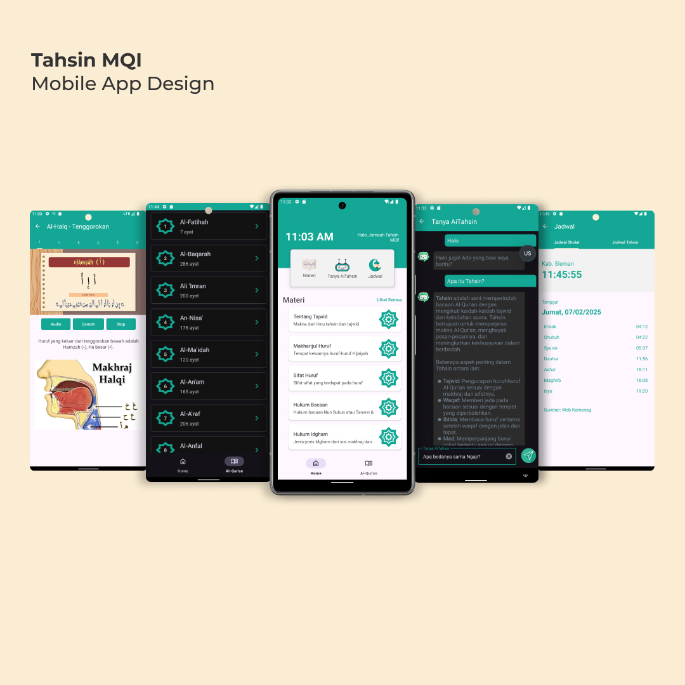

# Tahsin-MQI  
Repository for Android App Project: **Tahsin MQI – Quranic Recitation Improvement**

## Purpose  
A mobile application to help users improve their Quran recitation skills through structured lessons, AI-assisted feedback, and Islamic utilities. Built as part of a personal project to integrate faith and technology.

## Screenshots App  

## Features  

Final Submission Checklists  
- [x] Step-by-step **Tahsin Lessons** with audio & interactive exercises  
- [x] **Digital Quran** with translation and audio playback  
- [x] **AI-based chat** for Quran-related questions using Gemini AI  
- [x] Accurate **Prayer Times** based on user location  
- [x] **Offline-capable** with local data storage  
- [x] Modern, user-friendly **UI/UX**  

## Installation  
Download and install the latest version [here](https://github.com/e-haikal/TahsinMQI_Android_App/releases/download/v2.1/tahsin_mqi_2.1.apk)

## Technology Stack  
- Kotlin (Android Studio)  
- Local Storage  
- Gemini AI (for AI chat feature)  
- Quran API (for Quran content & prayer times)

## Author  
- **Asman Haikal**
